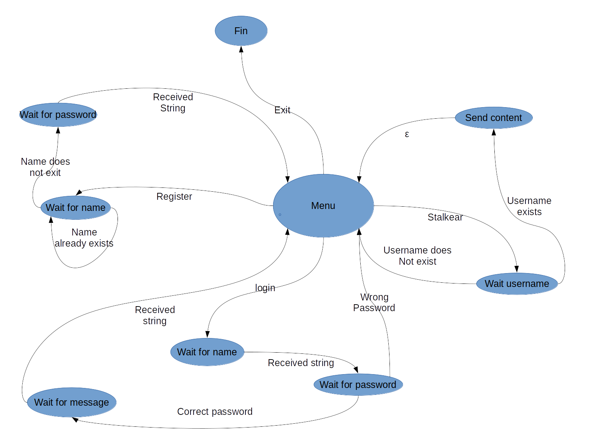

# Short Memories Manager 
Autores: Blanca Cano Camarero y José Luis Ruíz Benito  
Grupo de prácticas 2 DGIIM

# 1. Descripción de la aplicación, funcionalidad y actores que intervienen
Short Memories Manager es una aplicación inspirada en Twitter, cuyo objetivo es la publicación de mensajes cortos por parte de un usuario y que éstos puedan ser consultados por el resto. Cada mensaje está asociado a un único usuario autor.

Al iniciar el cliente, le mostramos al usuario un menú con cuatro opciones:  

- Login: acceder con un nombre de usuario y contraseña para publicar un mensaje
- Register: registrar un nuevo usuario, para ello deberá introducir un nombre de usuario y una contraseña
- Stalkear: consultar los mensajes publicados por otros usuarios
- Salir: cerrar el programa cliente

El cliente se encargará de establecer la conexión con el servidor, encargado de la auditoría, almacenamiento, publicación y consulta del contenido y cuentas. 

Éste servidor es además concurrente, es decir, admite varios clientes conectándose y haciendo peticiones simultáneamente.   

# 2. Diagrama de estados del servidor


# 3. Mensajes que intervienen
## Cliente
En este caso el código es la totalidad del mensaje.  

|Código|Descripción|
|---|---|
|`"login"`|Solicitud de acceso|
|`"register"`|Solicitud para registrar un usuario|
|`"stalkear"`|Solicitud para consulta de mensajes|
|`"exit"`|Solicitud para finalizar la conexión|

Tras cada uno de estos mensajes, el servidor entra en un protocolo distinto y responderá al cliente con nuevos mensajes.

## Servidor  

|Código|Descripción|
|---|---|
|`"OK"`|solicitud resuelta con éxito|
|`"no"`|solicitud resuelta sin éxito|
|`"FIN7777"`|final de la lista de mensajes de un usuario|

# 4. Evaluación de la aplicación  

Los mensajes que aparecen en el servidor son meramente informativos, tienen el fin de una mayor comprensión de qué procesos están ocurriendo en cada instante. 

## Registro de un usuario
#### Cliente

Abrimos dos clientes en paralelo: 


Instancia 1 del cliente:
```
====== Wellcome to short memories manager ====== 
What do you want to do? (Enter the number): 
1) Login 
2) Register
3) Stalkear someone
4) Exit   :(  
================== Option: 2
Type your user name
Sinforoso
Write a password: abcdefg
Sinforoso has create a new count
```
Instancia 2 del cliente:
```
====== Wellcome to short memories manager ====== 
What do you want to do? (Enter the number): 
1) Login 
2) Register
3) Stalkear someone
4) Exit   :(  
================== Option: 2
Type your user name
Herminia
Write a password: abcdefg
Herminia has create a new count
```
#### Servidor
```
New petition register
New user: Sinforoso Password: abcdefg
New petition register
New user: Herminia Password: abcdefg
```

### Caso de error: intentar registrar un usuario que ya existe
```
====== Wellcome to short memories manager ====== 
What do you want to do? (Enter the number): 
1) Login 
2) Register
3) Stalkear someone
4) Exit   :(  
================== Option: 2
Type your user name
Sinforoso
This name already exists
Try again:  
```

## Publicación de un mensaje
#### Cliente
Instancia 1 del cliente:
```
====== Wellcome to short memories manager ====== 
What do you want to do? (Enter the number): 
1) Login 
2) Register
3) Stalkear someone
4) Exit   :(  
================== Option: 1
User: Sinforoso
password: abcdefg
Login success
Write the line you want to post: ¡Hola, soy Sinforoso y esto es un mensaje de prueba!
```

Instancia 2 del cliente:
```
====== Wellcome to short memories manager ====== 
What do you want to do? (Enter the number): 
1) Login 
2) Register
3) Stalkear someone
4) Exit   :(  
================== Option: 1
User: Herminia
password: abcdefg
Login success
Write the line you want to post: Soy Herminia y éste es mi primer post

====== Wellcome to short memories manager ====== 
What do you want to do? (Enter the number): 
1) Login 
2) Register
3) Stalkear someone
4) Exit   :(  
================== Option: 1
User: Herminia 
password: abcdefg
Login success
Write the line you want to post: Soy Herminia y éste es mi segundo post

```

#### Servidor
```
New petition login
Sinforoso: ¡Hola, soy Sinforoso y esto es un mensaje de prueba!
New petition login
Herminia: Soy Herminia y éste es mi primer post
New petition login
Herminia: Soy Herminia y éste es mi segundo post
```

### Casos de error
Contraseña incorrecta: 
```
====== Wellcome to short memories manager ====== 
What do you want to do? (Enter the number): 
1) Login 
2) Register
3) Stalkear someone
4) Exit   :(  
================== Option: 1
User: Sinforoso
password: wrongpassword
Not valid user or password
```
Usuario no creado: 
```
====== Wellcome to short memories manager ====== 
What do you want to do? (Enter the number): 
1) Login 
2) Register
3) Stalkear someone
4) Exit   :(  
================== Option: 1
User: Gumersinda
password: *****
Not valid user or password
```

## Consulta de mensajes
#### Cliente

Instancia 1 ó 2 del cliente:
```
====== Wellcome to short memories manager ====== 
What do you want to do? (Enter the number): 
1) Login 
2) Register
3) Stalkear someone
4) Exit   :(  
================== Option: 3
User to stalkear: Sinforoso
All content of Sinforoso
¡Hola, soy Sinforoso y esto es un mensaje de prueba!
```

Instancia 1 ó 2 del cliente:
```
====== Wellcome to short memories manager ====== 
What do you want to do? (Enter the number): 
1) Login 
2) Register
3) Stalkear someone
4) Exit   :(  
================== Option: 3
User to stalkear: Herminia
All content of Herminia
Soy Herminia y éste es mi primer post
Soy Herminia y éste es mi segundo post
```

#### Servidor
```
New petition stalkear
New petition stalkear
```

### Casos de error

Consultar publicaciones de un usuario no creado: 
```
====== Wellcome to short memories manager ====== 
What do you want to do? (Enter the number): 
1) Login 
2) Register
3) Stalkear someone
4) Exit   :(  
================== Option: 3
User to stalkear: Gumersinda
Not valid user
```

## Salir del cliente
#### Cliente
```
====== Wellcome to short memories manager ====== 
What do you want to do? (Enter the number): 
1) Login 
2) Register
3) Stalkear someone
4) Exit   :(  
================== Option: 4
```

#### Servidor
```
New petition exit
```
